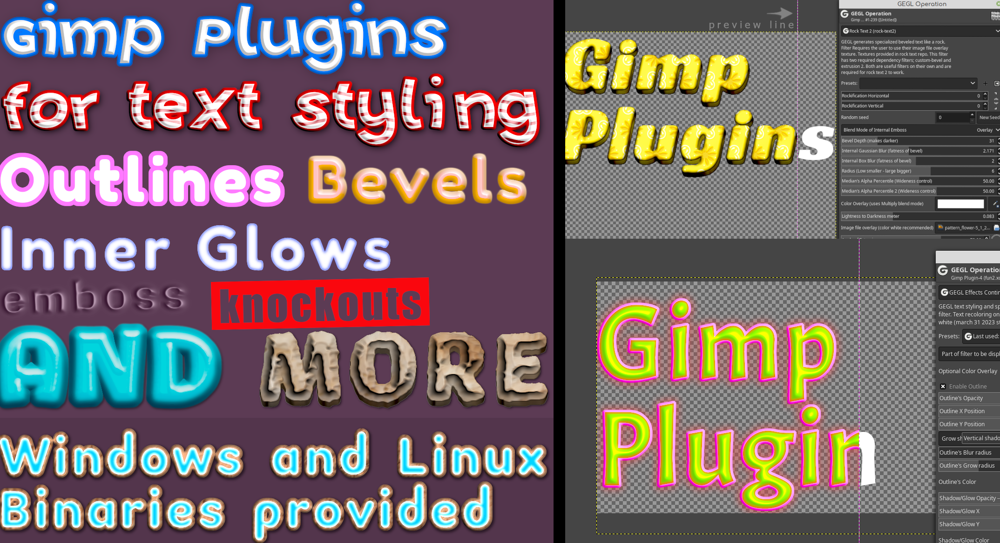
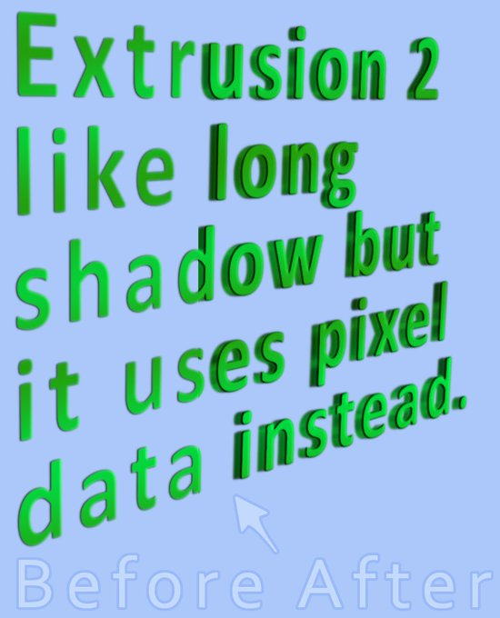

Beaver's third party GEGL Gimp Plugins for Gimp
=========
Welcome, I make third party GEGL filter plugins for Gimp by chaining GEGL nodes inside c file templates. This allows Gimp to have access to all sorts of cool text styling effects. It will turn your boring bland text into fancy text easy. Please view each filters individual Git page for more info on what each gimp plugin can do. You have the option to download twenty two (or three) of my best filters in one place but it may be better if you download each filter manually from my Github release sections as the list can get crowded and you may not need all my filters. I have 35 filters in total. Please remember all my filters are located in **the GEGL Operations section** of Gimp and no where else, and  that my text styling filters are meant to be applied on text layers or raster copies of text layers and they are NOT capable of real time updates on text layers. However in the future this may be possible. In general most of my text styling plugins REQUIRE using white text and selecting "**layer to image size**" on a text layer before applying. It is even smart to make a back up layer of original text.

All plugins can be compiled with Ninja and Meson but Windows, Linux and Chromebook users can use preconfigured binaries. Unforunately Mac users have to compile no matter what.

## Windows
.dll file filter binaries go in `C:\Users\USERNAME\AppData\Local\gegl-0.4\plug-ins` or perhaps `C:\Users\AppData\Local\gegl-0.4\plug-ins` then restart Gimp and open GEGL Operations.
You may need to create the folder 'plug-ins` if it does not exist. 
There is a very low chance Windows users will need to reinstall Gimp for plugins to work.

#### download for Windows here
[Top twenty something GEGL Plugins for Windows](https://cdn.discordapp.com/attachments/402851569692966914/1136076410830721165/windows_top_twenty_gegl_plugins.zip
)

If you choose to not use binaries this is how you compile my plugins on Windows. When compiling run the `build_linux.sh ` files with MySys2.

http://gimpchat.com/viewtopic.php?f=8&t=20038&hilit=windows+compile#p275148
)
  
## Linux 
.so file filter binaries go in `/home/(USERNAME)/.local/share/gegl-0.4/plug-ins` then restart Gimp and open GEGL Operations. 
#### download for Linux here
[Top twenty something GEGL Plugins for Linux and Source Code](https://cdn.discordapp.com/attachments/402851569692966914/1136076411308875816/linux_top_twenty_gegl_plugins.zip) 

 The only packages needed to compile on Linux are `ninja`, `meson` and `gegl`. On most distros you should be able to press the build_linux.sh and go.

Includes Linux binaries and Source Code 

## FLATPAK Linux (INCLUDES CHROMEBOOK GIMP AS FLATPAK) 
  so. file filter binaries go in `/home/(USERNAME)/.var/app/org.gimp.GIMP/data/gegl-0.4/plug-ins` then restart Gimp and open GEGL Operations. 
  
  ## SNAP Linux (NUMBER 393 VARIES)
  .so file filter binaries go `/home/USERNAME/snap/gimp/393/.local/share/gegl-0.4/plug-ins` NOTE - the number 393 may vary so read http://gimpchat.com/viewtopic.php?f=9&t=20336 
  for finding the right directory. Simply go back to `/home/USERNAME/snap/gimp/` and look for the correct number directory.  Once restart Gimp and open GEGL Operations.
  
## Mac OS (untested and no binaries) IF I GET HELP I MIGHT BE ABLE TO SUPPORT MAC.

.dylib file filter binaries go in `/Library/Application Support/gegl/0.4/plug-ins/`
or perhaps `/home/(USERNAME)/.local/share/gegl-0.4/plug-ins`

You may need to create `plug-ins` folder if it doesn't exist.

--Instructions to compile on Mac due to lack of binaries  --

https://brew.sh/

http://gimpchat.com/viewtopic.php?f=8&t=20357

Install Homebrew with `/bin/bash -c "$(curl -fsSL https://raw.githubusercontent.com/Homebrew/install/HEAD/install.sh)"`
then

https://formulae.brew.sh/formula/meson#default
`brew install meson`

https://formulae.brew.sh/formula/ninja#default
`brew install ninja`

https://formulae.brew.sh/formula/gegl#default
 `brew install gegl`
  
  Then Compile every C file as you would on Linux using Meson and Ninja. Perhaps even my build.sh script will work.
Then right-click on each individual .dylib file and then select open (in the finder), and it asks if you really want to open it. After that restart Gimp
go to GEGL Operations. The plugin('s) *should work.  Each .dylib file needs to be manually approved. So running this in a folder to do exactly the same thing 
may be a good idea. `cd ~/Library/Application Support/gegl/0.4/plug-ins/ # assuming it was installed here
sudo xattr -rd com.apple.quarantine *`
  
  ## The five most recommended filters are in this particular order 
  
### 1. GEGL Effects (The layer effects counter part)
https://github.com/LinuxBeaver/GEGL-Effects---Layer-Effects-in-Gimp-using-GEGL/ 

and or 
https://github.com/LinuxBeaver/GEGL-Effects---Layer-Effects-in-Gimp-using-GEGL/tree/ContinualEdition
    
  
  This filter also ships with GEGL Inner Glow and GEGL Bevel which are useful operations on their own.
  
## 2. Custom Bevel
#BECAUSE OF YOUR CARE AND SUPPORT A SPECIAL BRANCH OF CUSTOM BEVEL IS NOW ACCEPTED IN GIMP 3 AND WILL BE IN FUTURE 2.99 BUILDS - (JUNE 15 2023)
https://github.com/LinuxBeaver/GEGL-Custom-Bevel
  
 
 This is a dedicated Bevel filter for Gimp that goes far beyond what my basic gegl:bevel can do.
  
## 3. SSG
https://github.com/LinuxBeaver/GEGL-SSG-Stroke-Shadow-Glow-/

A imrpoved version of Gimp's Drop Shadow filter but it starts as a outline and knocks out the original image unless set to normal blend mode. It even has an image file overlay mode. It will be far more useful in Gimp 3.2
  
  
## 4. Extrusion 2 
https://github.com/LinuxBeaver/GEGL-Extrusion-2----Fork-of-GEGL-Long-Shadow
 
   Just like the long shadow filter but it uses pixel data
   

  
## 5. Glossy Balloon
https://github.com/LinuxBeaver/GEGL-glossy-balloon-text-styling
  
  
  
  A glossy bevelish effect that looks like glossy paste.

  ## Completion of Project - THIS PROJECT IS COMPLETE
  As of June 30th 2023 Beaver Considers their GEGL Project 100% complete. There will be a very low incentive for plugin updates (outside of breakages) and even a lower incentive on new plugins coming into existence. Beaver spent exactly 2 years studying GEGL and he hopes that he can share his knowledge with the world. Anyone else is welcome to pick up where Beaver left off. It is time for Beaver to retire from LibreGraphics Land. I had so much fun making GEGL plugins for Gimp.

## Avoid SubFolders and non binary content in GEGL Plugins directory
Some people are having issues with my GEGL/Gimp plugins because they are making sub folders for each GEGL plugin of mine. All GEGL plugins should be in the same folder with no subfolders or any other file type. Folder should only contain binaries (.dll or .so) for your OS. Subfolders of binaries can lead to scenarios where users have two copies of a dependency and GEGL defaults to using an older version thus breaking plugins that need a newer dependency. Other file types could lead to Gimp not starting up.

## Lastly, (common complaint), If GEGL Effects breaks after downloading a new plugin of mine that is because the new plugin has a more recent dependency GEGL Effects needed, this can easily be fixed  by updating to the latest version of GEGL Effects.
  
  Enjoy!
  

