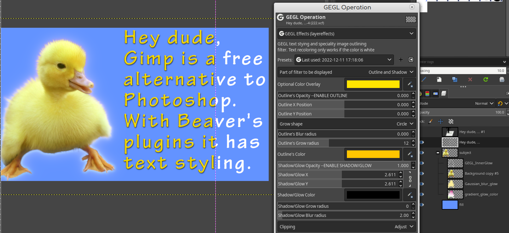

Beaver's third party GEGL Plugins for Gimp
=========
Welcome, I make third party GEGL filter plugins for Gimp by chaining GEGL nodes inside c file templates. This allows Gimp to have access to all sorts of cool text styling effects. It will turn your boring bland text into fancy text easy. 

## Windows
Filters go in C:\Users<YOUR NAME>\AppData\Local\gegl-0.4\plug-ins then restart Gimp and open GEGL Operations.
  Download for Windows here. But Linux binaries are available in each Github page. Reason Linux doesn't get the 
  same treatment is because it is a taboo for Linux users to get direct binary downloads (especially all in one place).

https://cdn.discordapp.com/attachments/402851569692966914/1052754123352711259/Beaver-Compiled_GEGL_Binaries_for_windows_12_14.zip
  
  
## Linux 
Filters go in /home/(USERNAME)/.local/share/gegl-0.4/plug-ins then restart Gimp and open GEGL Operations. 
Linux Binaries are available  on each release page.
  
  
## FLATPAK Linux
  Filters goes in /home/(USERNAME)/.var/app/org.gimp.GIMP/data/gegl-0.4/plug-ins then restart Gimp and open GEGL Operations. 
  
  
  
  

