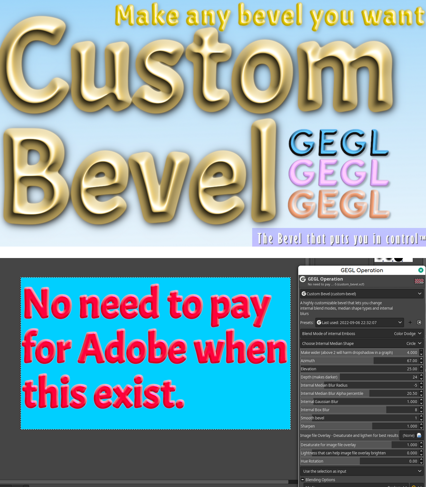

Beaver's third party GEGL Plugins for Gimp
=========
Welcome, I make third party GEGL filter plugins for Gimp by chaining GEGL nodes inside c file templates. This allows Gimp to have access to all sorts of cool text styling effects. It will turn your boring bland text into fancy text easy. Please view each filters individual Git page for more info on what each filter can do.

## Windows
Filter binaries go in `C:\Users<YOUR NAME>\AppData\Local\gegl-0.4\plug-ins` then restart Gimp and open GEGL Operations.
  Download for Windows here. But Linux binaries are available in each Github page. Reason Linux doesn't get the 
  same treatment is because it is a taboo for Linux users to get direct binary downloads (especially all in one place).

https://cdn.discordapp.com/attachments/402851569692966914/1052754123352711259/Beaver-Compiled_GEGL_Binaries_for_windows_12_14.zip
  
  
## Linux 
Filter binaries go in `/home/(USERNAME)/.local/share/gegl-0.4/plug-ins` then restart Gimp and open GEGL Operations. 
Linux Binaries are available  on each release page.
  
  
## FLATPAK Linux
  Filter binaries goes in `/home/(USERNAME)/.var/app/org.gimp.GIMP/data/gegl-0.4/plug-ins` then restart Gimp and open GEGL Operations. 
  
  
  The five most recommended filters are in this particular order 
## GEGL Effects (The layer effects counter part)
https://github.com/LinuxBeaver/GEGL-Effects---Layer-Effects-in-Gimp-using-GEGL/
  
  
## Custom Bevel
https://github.com/LinuxBeaver/GEGL-Custom-Bevel
  
  
  
## Extrusion 2 
https://github.com/LinuxBeaver/GEGL-Extrusion-2----Fork-of-GEGL-Long-Shadow
 
   Just like the long shadow filter but it uses pixel data

  
## Glossy Balloon
https://github.com/LinuxBeaver/GEGL-glossy-balloon-text-styling
  
  
A glossy bevelish effect that looks like glossy paste.
  
 ## Neon Border 
 https://github.com/LinuxBeaver/GEGL-Neon-Border
 
 GEGL Makes a classical Neon Border effect
  
  
  Enjoy!
  

