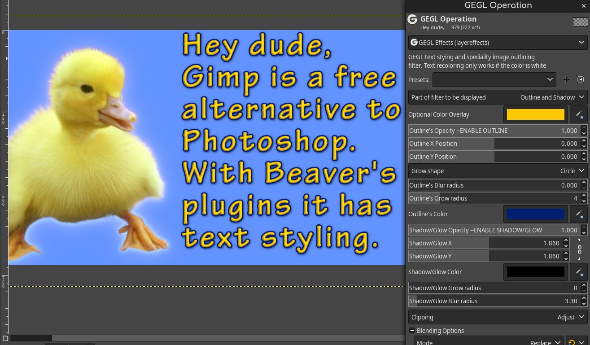
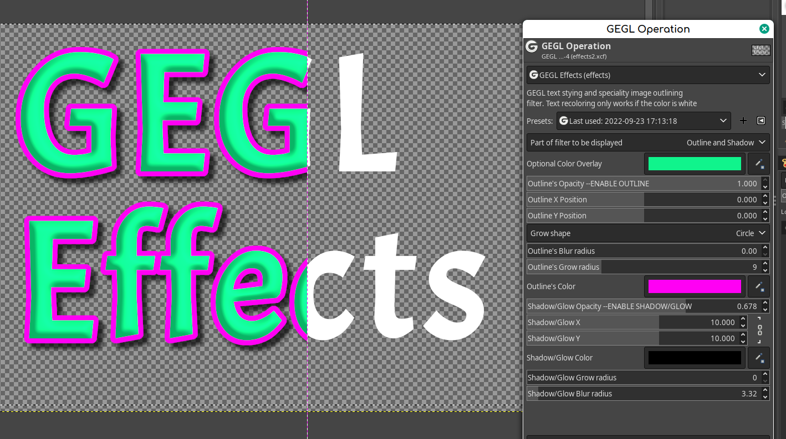
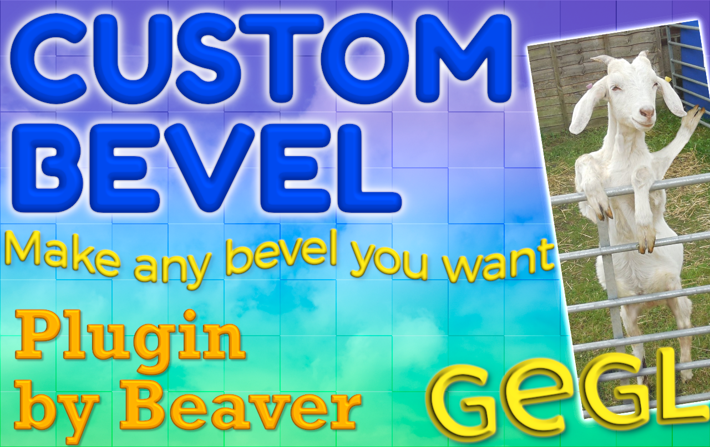
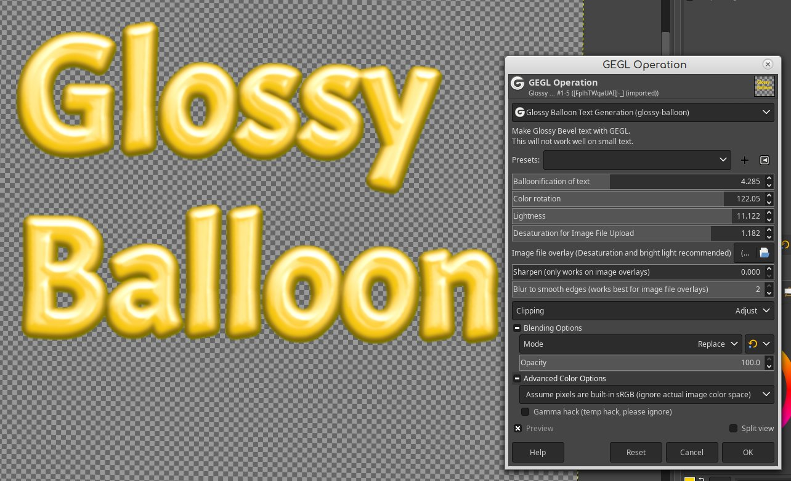

Beaver's third party GEGL Gimp Plugins for Gimp
=========
Welcome, I make third party GEGL filter plugins for Gimp by chaining GEGL nodes inside c file templates. This allows Gimp to have access to all sorts of cool text styling effects. It will turn your boring bland text into fancy text easy. Please view each filters individual Git page for more info on what each gimp plugin can do. You have the option to download twenty of my best filters in one place but it may be better if you download each filter manually from my Github release sections as the list can get crowded and you may not need all my filters. I have 34 filters in total. Please remember that my text styling filters are meant to be applied on text layers or raster copies of text layers and they are NOT capable of real time updates on text layers. However in the future this may be possible. 

All plugins can be compiled with Ninja and Meson but Windows, Linux and Chromebook users can use preconfigured binaries. Unforunately Mac users have to compile no matter what.

## Windows
.dll file filter binaries go in `C:\Users\USERNAME\AppData\Local\gegl-0.4\plug-ins` or perhaps `C:\Users\AppData\Local\gegl-0.4\plug-ins` then restart Gimp and open GEGL Operations.
You may need to create the folder 'plug-ins` if it does not exist. 
There is a low chance Windows users will need to reinstall Gimp for plugins to work.

[Top twenty GEGL Plugins for Windows](https://cdn.discordapp.com/attachments/402851569692966914/1097718529614151680/Top_GEGL_plugins_for_Windows_april17.zip)
  
## Linux 
.so file filter binaries go in `/home/(USERNAME)/.local/share/gegl-0.4/plug-ins` then restart Gimp and open GEGL Operations. 

[Top twenty GEGL Plugins for Linux and Source Code](https://cdn.discordapp.com/attachments/402851569692966914/1097718529278611546/Top_GEGL_plugins_for_Linux_april17.zip)

Includes Linux binaries, Windows Binaries and Source Code 

## FLATPAK Linux (INCLUDES CHROMEBOOK GIMP AS FLATPAK) 
  so. file filter binaries go in `/home/(USERNAME)/.var/app/org.gimp.GIMP/data/gegl-0.4/plug-ins` then restart Gimp and open GEGL Operations. 
  
  ## SNAP Linux (NUMBER 393 VARIES)
  .so file filter binaries go `/home/USERNAME/snap/gimp/393/.local/share/gegl-0.4/plug-ins` NOTE - the number 393 may vary so read http://gimpchat.com/viewtopic.php?f=9&t=20336 
  for finding the right directory. Simply go back to `/home/USERNAME/snap/gimp/` and look for the correct number directory.  
  
## Mac OS (untested and no binaries) IF I GET HELP I MIGHT BE ABLE TO SUPPORT MAC.

.dylib file filter binaries go in `/Library/Application Support/gegl/0.4/plug-ins/`
or perhaps `/home/(USERNAME)/.local/share/gegl-0.4/plug-ins`

You may need to create `plug-ins` folder if it doesn't exist.

--Instructions to compile on Mac due to lack of binaries  --

https://brew.sh/

http://gimpchat.com/viewtopic.php?f=8&t=20357

Install Homebrew with `/bin/bash -c "$(curl -fsSL https://raw.githubusercontent.com/Homebrew/install/HEAD/install.sh)"`
then

https://formulae.brew.sh/formula/meson#default
`brew install meson`

https://formulae.brew.sh/formula/ninja#default
`brew install ninja`

https://formulae.brew.sh/formula/gegl#default
 `brew install gegl`
  
  Then Compile every C file as you would on Linux using Meson and Ninja. Perhaps even my build.sh script will work.
  There is a chance Gimp will need to be reinstalled after installing the plugins.
  
  ## The five most recommended filters are in this particular order 
  
### 1. GEGL Effects (The layer effects counter part)
https://github.com/LinuxBeaver/GEGL-Effects---Layer-Effects-in-Gimp-using-GEGL/ 

and or 
https://github.com/LinuxBeaver/GEGL-Effects---Layer-Effects-in-Gimp-using-GEGL/tree/ContinualEdition
    
  
  This filter also ships with GEGL Inner Glow and GEGL Bevel which are useful operations on their own.
  
## 2. Custom Bevel
https://github.com/LinuxBeaver/GEGL-Custom-Bevel
  
 
 This is a dedicated Bevel filter for Gimp that goes far beyond what my basic gegl:bevel can do.
  
## 3. SSG
https://github.com/LinuxBeaver/GEGL-SSG-Stroke-Shadow-Glow-/

A imrpoved version of Gimp's Drop Shadow filter but it starts as a outline and knocks out the original image unless set to normal blend mode. It even has an image file overlay mode. It will be far more useful in Gimp 3.2
  
  
## 4. Extrusion 2 
https://github.com/LinuxBeaver/GEGL-Extrusion-2----Fork-of-GEGL-Long-Shadow
 
   Just like the long shadow filter but it uses pixel data

  
## 5. Glossy Balloon
https://github.com/LinuxBeaver/GEGL-glossy-balloon-text-styling
  
  
  
  A glossy bevelish effect that looks like glossy paste.
  

  
  Enjoy!
  

